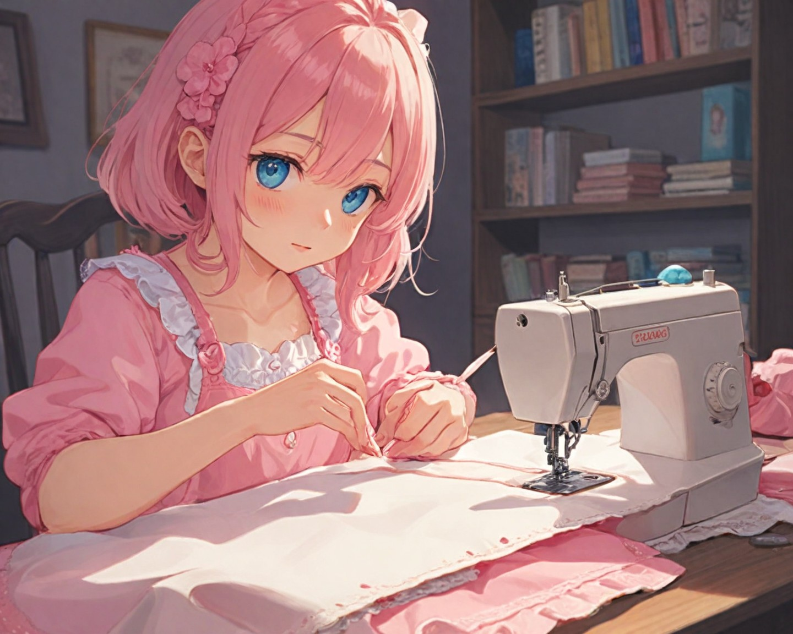
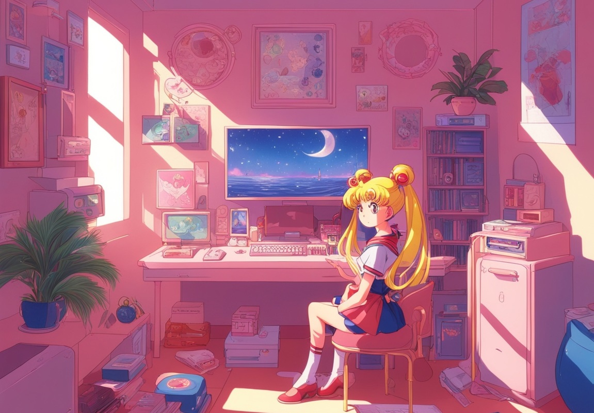

# Microblog

## Overall description

HTML, Bootstrap, CSS, JavaScript and Postman are the foundations that make this website run. It is meant to be a microblog focused on sewing. My website has a navbar located at the top of each page and a footer at the bottom which remains consistent throughout every page with the exception of a logout button once logged in:

Index page: a minimalistic page greets you with a login button.

Login/Register page: these pages feature fields and buttons that respectively serve their function including a 'Remember me' checkbox (not functional).

Posts page: Upon logging in, you are greeted with a feed featuring other user's posts.

Profile page: profile information is displayed in a card alongside a text field where users can create a new post.

## Images

## Describe one piece of code

Redirecting the user to a different page upon clicking a button was a nightmare to figure out: we ultimately settled on using Javascript in order to remain consistent in stylization without needing to add more to CSS.
